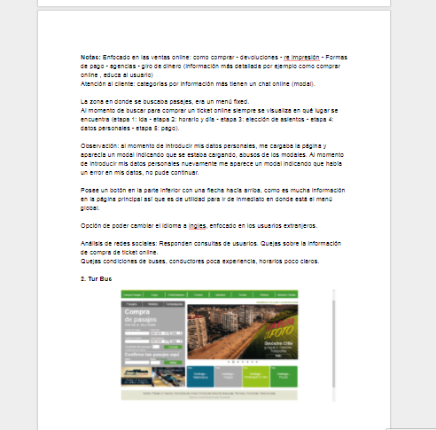
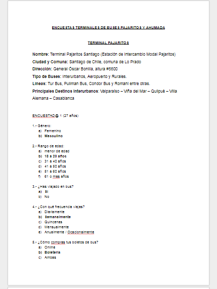
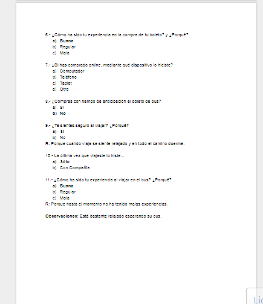

SafeTravel
---------------------------------------------------------------------------------------------------------------

Safetravel es una plataforma de venta y reserva de pasajes de autobús de diferentes líneas comerciales ofreciendo, como valor agregado, recomendaciones personalizadas según los intereses del usuario.

Desarrollado para
-----------------------------------------------------------------------------------------------------------------
Laboratoria

NUEVA EXPERIENCIA EN EMPRESAS DE BUSES
Nuestro proceso de diseño

DESCUBRIMIENTO E INVESTIGACIÓN
--------------------------------------------------------------------------------------------------------------------
Planeamiento 

Division de tareas en el equipo de "los primeros pasos"

User Research

a- Benchmark ( investigacion de paginas de buses para compararlas )  
b-Preparacion de una Guia de entrevistas  
c-Encuestas Online  
d-Salidas a terminales de buses para entrevistar usuarios, observar su comportamiento y obtener documentacion importante en cada una de las Terminales  

a- Demostracion de benchmark :
-----------------------------------

 

b- Paralelamente , empezamos a crear las preguntas para las entrevistas a usuarios en los terminales de buses:
--------------------------------------------------------------------------------------------------------------------

 

c- Encuestas Online, nos daria datos cuantitativos:
---------------------------------------------------------------------------------------------------------------------

d- Salida a las diferentes Terminales de buses en Santiago:
-----------------------------------------------------------------------------------------------------------------------

 

Al promediar las 16:00 horas, el equipo se junto con la finalidad de compartir sus experiencias durante el trabajo en campo, darse feedbacks sobre lo que se hizo bien, pudo haber sido mejor y como cada una hubiera abordado la situación.

Ya con los datos comparados, el equipo procede con la investigacion.

SINTESIS Y DEFINICIÓN
-------------------------------------------------------------------------------------------------------------------------

1.- Affinity Mapping

Durante las horas de clases, y con la orientación de nuestros profesores Claire, se comenzó a trabajar para realizar el ejercicio de findings en post it para posteriormente realizar el Affinity Mapping donde se agruparon los problemas según su categoría.

Se agruparon todas las observaciones de los usuarios en las siguientes categorías :

Compras  
Dudas  
Información  
Preferencias  
Reclamos  
Recomendaciones  
otros  

Luego de analizar todo la información obtenida, nos dimos cuenta de que de las categorías Información y Reclamos tienen más coincidencia entre nuestros usuarios, por ellos decidimos abordar estas categorías para la obtención de nuestra problemática.

 

User persona
----------------------------------------------------------------------------------------------------------------------------

Con la información recaudada de las entrevistas, se define nuestro User Persona.

Problem Statement
----------------------------------------------------------------------------------------------------------------------------

{Alejandra} Necesita encontrar la información constante del viaje en el bus para sentirse más segura, cómoda y comunicárselo a sus seres queridos.

HMW Ayudar a nuestros usuarios a que obtengan más información sobre seguridad y confort en la experiencia de viajar.

What if - acceso ranking de los buses.  
What if - que los usuarios puedan ser más específicos en su búsqueda.   
What if - que los usuarios obtengan notificaciones durante el viaje para compartirlo.  
What if-que se pueda ver la ubicación de nuestro bus.  

StoryTelling
----------------------------------------------------------------------------------------------------------------------------

"Hola soy Alejandra y viajo los fines de semana largos y en vacaciones de verano, uso buses para ir a ver a mi familia y amigos. Mi familia es muy preocupada, en todo momento quiere saber cómo estoy.

Cuando viajo compro mis pasajes por internet y hay veces que me re-venden los pasajes, o el bus no está en buenas condiciones, no me gusta muchas veces la atención de los auxiliares.

Me importa estar segura a bordo, saber que cuando compro un pasaje puedo subir tranquila, saber datos de cual es la mejor opcion y si puedo tener beneficios más seguido. Si no me siento comoda no me dan ganas de viajar y prefiero quedarme en casa.

Si existiera una forma de saber esta información antes de subirme al bus y no descubrirlo a bordo, sería muy importante.

Con la aplicación que están proponiendo, me daría seguridad y confianza en que el trayecto y la compra del pasaje será buena, sin duda aumenta mi frecuencia con la que viajó, Con el seguimiento de trayecto me da seguridad a mi y tambien le da tranquilidad a mi familia de que llegare bien y descansada"

Mapa de empatia 
----------------------------------------------------------------------------------------------------------------------------

Custumer Journey Map
----------------------------------------------------------------------------------------------------------------------------

IDEACIÓN
--------------------------------------------------------------------------------------------------------------------------

Prototype

Con nuestro MVP definido, se procede a realizar el prototipo.

Primeros pasos en la realizacion de sketches, que se fueron mejorando cada vez que testesmos con usuarios y recibimos feedback .

https://invis.io/Q5FJSUF2YNC#/275899506_Boleta (link)

Y el MPV final:

https://marvelapp.com/136jga16/screen/38086057

