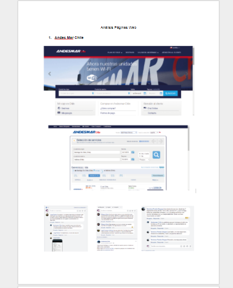

SafeTravel
---------------------------------------------------------------------------------------------------------------

Safetravel es una plataforma de venta y reserva de pasajes de autobús de diferentes líneas comerciales ofreciendo, como valor agregado, recomendaciones personalizadas según los intereses del usuario.

Desarrollado para
-----------------------------------------------------------------------------------------------------------------
Laboratoria

NUEVA EXPERIENCIA EN EMPRESAS DE BUSES
Nuestro proceso de diseño

DESCUBRIMIENTO E INVESTIGACIÓN
--------------------------------------------------------------------------------------------------------------------
Planeamiento 

Division de tareas en el equipo de "los primeros pasos"

User Research

a- Benchmark ( investigacion de paginas de buses para compararlas )
b-Preparacion de una Guia de entrevistas
c-Encuestas Online
d-Salidas a terminales de buses para entrevistar usuarios, observar su comportamiento y obtener documentacion importante en cada una de las Terminales.

a- Demostracion de benchmark

 

https://docs.google.com/forms/d/1tFWq72OSTLYz16oZBjiCYeGcNTIOBuGOarTyn-86azs/edit
